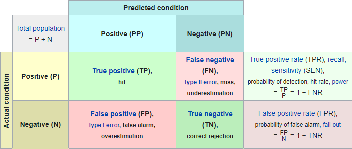

```{css, echo=FALSE}
.tarea {
  padding: 1em;
  border: 2px solid red;
  border-radius: 10px;
  margin-bottom: 10px;
}
```

> A tree with strong roots laughs at storms.
> --- Malay proverb

Parecerá a simple vista que, en la clase de hoy, sólo veremos el uso de árboles de decisión en nuestro problema.
Será mucho más profundo.
Hoy utilizaremos a los árboles para hablar del **orden** y de **errores producto del azar**.

Manos a la obra, iniciando el entorno y cargando los datos.

```{r}

rm( list=ls() )
gc(verbose = FALSE)
```

```{r}
library( "data.table")
library("ggplot2")

carpeta_datasetsOri <-  "../../../datasetsOri/"
septiembre <- "paquete_premium_202009.csv"

ds <- fread(paste0(carpeta_datasetsOri, septiembre,collapse = ""), header=TRUE, showProgress = FALSE)

```

Empecemos con un poco de *gimnasia algorítmica:*

**Preguntas sobre árboles**

-   ¿Es posible encontrar ganancia positiva en un corte sobre una variable?

-   ¿Cuál es la cardinalidad de los *intervalos* que dan ganancia?

-   ¿Cómo trata los árboles las variables con datos ausentes?

-   Usualmente se suele cortar las variables en 2 intervalos

    -   ¿Se podría cortar en más intervalos?

    -   ¿Cuál sería el costo?

    -   ¿Se obtendrían mejores resultados?

-   ¿Cuanto le afecta el """desbalanceo""" de datos al algoritmo?

Debemos ahora convertirnos en **dendrólogos**, estudiar con profundidad nuestros árboles.
Tomemos un espécimen, construyendo nuestro árbol

```{r}
library(rpart)

arbol  <- rpart("clase_ternaria ~ .",
                 data = ds,
                 xval=0,
                 cp=0, 
                 minsplit=  80,
                 minbucket=  1,
                 maxdepth=   5 )

```

Empecemos a analizar su estructura

```{r}

arbol

```

Una de las muchas ventajas que tienen los árboles es la simpleza que tienen para ser implementados en fácilmente en sistemas productivos, dado que la reescritura de las reglas de salida es muy simple.

::: {.tarea}
**TAREA OPCIONAL**

Implemente las reglas del árbol anterior hasta el nivel 2 (hasta la regla 7) en **SQL**.
:::

R nos da herramientas para visualizar los árboles.
Probemos

```{r}
library( "rpart.plot" )

prp( arbol, extra=101, digits=5, branch=1, type=4, varlen=0, faclen=0 )
```

Esta horrible visualización, principalmente porque no queda expresado de forma clara donde flujen los grandes volúmenes de clientes en cada uno de los nodos.
Dedicamos unos instantes en entenderlo nosotros revisando las reglas nuevamente.

Estas herramientas no nos permiten jugar con los árboles al nivel que necesitamos.
Nos gustaría poder tener en una tabla todas las *hojas* (nodos terminales) para poder analizar mejor nuestro árbol.

Para solucionar este problema, construimos la siguiente función, y entendemos a través de la experiencia, que R no es el lenguaje más lindo para escribir código.
(**¡maldigo la invención de los rownames!**)

```{r}

tablahojas <- function (arbol, datos, target = "clase_ternaria") {

  # Tomamos la columna con el target
  target_vector <- datos[, get(target)]
  # Tomamos las clases de nuestro target
  classes <- unique(target_vector)
  
  # Tomamos las posicion de las hojas que aplican a los registro de nuestro ds
  row_leaf <- unique(arbol$where)
  
  leaves <- data.table(row_frame = row_leaf)
  setkey(leaves,row_frame)
  
  # Relacion target ~ hojas
  leaves_target <- dcast(
    data.table(
      target=target_vector, 
      leaf = arbol$where),
    leaf ~ target, length, 
    value.var = "target")
  
  setkey(leaves_target, leaf) 
  
  # Juntamos todo
  leaves_target <- leaves_target[leaves,nomatch=0]
  
  # Sumamos algunas columnas calculadas
  colnames(leaves_target[,classes,with=FALSE])[apply(leaves_target[,classes,with=FALSE],1,which.max)]
  # Clase mayoritaria
  leaves_target[, 
                y:=colnames(
                    leaves_target[,classes,with=FALSE]
                  )[
                    apply(leaves_target[,classes,with=FALSE],1,which.max)]
                ]
  
  # Cantidad de elementos de la hoja
  leaves_target[, TOTAL := unlist(Reduce(function(a,b) Map(`+`,a,b), .SD)), .SDcols=classes]

  leaves_target
}

```

La función extrae la información del modelo de la estructura de datos que nos devuelve la librería `rpart`

Aplicamos nuestra función

```{r}

hojas <- tablahojas(arbol, ds)

```

```{r}
hojas[,]
```

**Pregunta***:*

-   ¿Con qué criterio eligió la clase de cada hoja que determino la clasificación de los registros?

Vemos que el algoritmos eligió algunas una hojas la clase `BAJA+2`.
Calculemos la ganancia que tiene cada rama.

```{r}

hojas[, ganancia:= `BAJA+2`*48750 - 1250*(CONTINUA + `BAJA+1`)]
hojas

```

Si hiciéramos caso a las clases del árbol, tendríamos una ganancia de:

```{r}

hojas[y == "BAJA+2", .(ganancia=sum(ganancia), enviados=sum(TOTAL), sevan=sum(`BAJA+2`))]

```

Pero, si tomamos todas las ramas que nos dieron ganancia positiva:

```{r}

hojas[ganancia > 0, .(ganancia=sum(ganancia), enviados=sum(TOTAL), sevan=sum(`BAJA+2`))]

```

Wow!!
Estábamos dejando mucho plata sobre la mesa!
**MUCHA**

Veamos cómo clasificó a las hojas que nos dan ganancia positiva:

```{r}

hojas[ganancia > 0, .N, by=y]

```

¿Por qué otras hojas que no clasifica como `BAJA+2` dan ganancia positiva?

Entendemos que se debe a la cantidad de casos en cada nodo y la proporción de `BAJA+2` en cada hoja.
Ya se había calculado en clase la probabilidad necesaria de la clase `BAJA+2` para considerar que da ganancia.

Los árboles, al agrupar elementos, nos deja este concepto mucho más claro.

Continuaremos explorando nuestros árboles, pero ahora vamos a trabajar con una nueva **clase**, una binaria

-   Si `clase_ternaria == BAJA+2` $\rightarrow$ `evento`

-   Si `clase_ternaria != BAJA+2` $\rightarrow$ `noevento`

```{r}
ds[, clase_binaria := ifelse(clase_ternaria == "BAJA+2", "evento", "noevento")]

# Sacamos la clase ternaria
ds[, clase_ternaria:= NULL]
```

Con el nuevo `target`, pasamos a ajustar nuevamente.

```{r}

arbolbinario <- rpart("clase_binaria ~ .",
                 data = ds,
                 xval=0,
                 cp=0, 
                 minsplit=  80,
                 minbucket=  1,
                 maxdepth=   5 )
arbolbinario

```

Ahora aplicamos nuestra función para trabajar con los resultados:

```{r}

hojasbinario <- tablahojas(arbolbinario, ds, "clase_binaria")

```

```{r}
hojasbinario
```

Agreguemos una variable de `ganancia` y revisemos rápidamente la ganancia que obtenemos por clase *evento*

```{r}

hojasbinario[, ganancia:= evento*48750 - 1250*noevento]
hojasbinario[y == "evento", .(ganancia=sum(ganancia), enviados=sum(TOTAL), sevan=sum(evento))]

```

Y veamos la ganancia total si tomamos todos los nodos donde la misma es positiva:

```{r}

hojasbinario[ganancia > 0, .(ganancia=sum(ganancia), enviados=sum(TOTAL), sevan=sum(evento))]

```

Dejando ya de ver las hojas que generan ganancia positiva, pasemos a ver si podemos inferir las misma a través de la probabilidad del evento, y de paso validar los cálculos hechos con anterioridad.

```{r}

hojasbinario[, c("p_evento","p_noevento"):= list(evento/TOTAL, noevento/TOTAL) ]

hojasbinario
```

Con esta definición y las probabilidades obtenidas, nos planteamos evaluar cuál debe ser nuestro punto de corte, y de esta manera dejar de evaluar las *hojas* del árbol.

Para esto, ordenamos nuestras probabilidades de salida de forma *descendente*.
Estoy puede parecer contra intuitivo al principio, pero a nosotros nos interesan las *probabilidades* más altas solamente.

```{r}
hojasordenadas <- hojasbinario[order(-p_evento),]
```

Como más de una *hoja* de salida puede compartir la misma probabilidad, las agrupamos según su probabilidad.

```{r}
hojasordenadas <- hojasordenadas[,.(evento=sum(evento), 
                              noevento=sum(noevento),
                              n=sum(TOTAL),
                              ganancia=sum(ganancia)),by=p_evento]
hojasordenadas
```

Calculemos la ganancia acumulada.
Los primero registros, los correspondientes a los probabilidades más altas, son de esperar que tengan una mayor ganancia.
Luego esta debería caer hasta el piso, que sería el costo de enviar a todos los clientes `premium` un estímulo.

```{r}
hojasordenadas[, gan_acum:=cumsum(ganancia)]
hojasordenadas
```

**Preguntas**

-   ¿Cuál es la máxima ganancia posible es nuestro árbol?

-   ¿Cuál es el `punto de corte` que sugiere?

-   ¿Por qué es distinto al teórico?

-   ¿Es nuestro `punto de corte` es igual de útil?

Y por último grafiquemos la `probabilidad` en función de la `ganancia`, para tener una dimensión del problema que enfrentamos si elegimos mal el `punto de corte`.

```{r}
ggplot(hojasordenadas, aes(x=p_evento ,y=gan_acum)) +
     scale_x_reverse() +
     geom_line(size=1)

```

**Pregunta**

-   ¿Cómo interpretamos este gráfico?

Existen más formas de medir la calidad del modelo a través de las probabilidades que nos entrega.
A nivel global podemos usar `AUC` (área bajo la [**curva ROC**](https://en.wikipedia.org/wiki/Receiver_operating_characteristic)), que nos muestra el comportamiento global de la performance del modelo.

Vamos a trabajar de forma casera para el cálculo de los indicadores **básicos**.
Más adelante usaremos librerías, pero es importante que todo **data scientist** tenga la capacidad de poder calcular esta métrica, incluso en un **xls**.

Para la **curva ROC** vamos a necesitar construir una [Matriz de confusión](https://en.wikipedia.org/wiki/Confusion_matrix#Table_of_confusion) por cada **punto de corte** posible.



Para esto, vamos a sumar las variables `tp`, `tn`, `fp` y `fn`.

```{r}

hojasordenadas[, c("evento_acum","noevento_acum"):=list(cumsum(evento),cumsum(noevento))]
total_evento <- hojasordenadas[,sum(evento)]
total_noevento <- hojasordenadas[,sum(noevento)]

hojasordenadas[, c("evento_restantes","noevento_restantes"):=list(total_evento - evento_acum,total_noevento - noevento_acum )]

hojasordenadas[,tp:=evento_acum]
hojasordenadas[,tn:=noevento_restantes]
hojasordenadas[,fp:=noevento_acum]
hojasordenadas[,fn:=evento_restantes]

```

```{r}

hojasordenadas[, .(p_evento, tp, tn, fp, fn)]
```

Ya con nuestras **matrices de confusión** armadas, necesitamos 2 variables derivadas más para armar nuestra curva:

```{r}

hojasordenadas[,tpr:=(tp/(tp+fn))]
hojasordenadas[,fpr:=(fp/(fp+tn))]

```

La **curva ROC** es la curva resultante en la relación del **ratio de falsos positivos** y **ratio de verdaderos positivos**.

```{r}

ggplot(hojasordenadas, aes(x=fpr,y=tpr)) + 
  geom_abline(intercept=0,slope=1) +
  geom_line(lwd=1) 

```

**Pregunta**

-   ¿Qué representa la **curva ROC**?

Como es muy complejo reflejar en palabras una curva, se suele calcular el área bajo su curva, **auc** y reflejar ese valor como métrica de la calidad del modelo.

Calculamos su área

```{r}
# install.packages("geometry")
library(geometry)

x <- c(hojasordenadas$fpr,1)
y <- c(hojasordenadas$tpr, 0)
polyarea(x, y)

```

Finalmente, luego de un largo trabajo, tenemos el famoso **AUC**.
Larga vida a las librerías!

**Preguntas**

-   ¿**AUC** es una métrica global o local?

-   ¿Pueden dos curvas distintas tener un mismo valor de **AUC**?

Las variables que construimos para llegar a este resultado, son muy útiles para el cálculo de otras *métricas*, como por ejemplo el **nada recomendable de usar**: **Accuracy.** Pero para todos los posibles `puntos de corte` y no sólo para el arbitrario 0.5.

```{r}

hojasordenadas[, acc:= ((tp + tn)/(tp+tn+fp+fn))]

```

Desde esta forma podemos ver también al **accuracy** como curva

```{r}

ggplot(hojasordenadas, aes(x=p_evento,y=acc)) + 
  geom_line(lwd=1) +
  geom_vline(xintercept = 0.025, linetype="dotted")

```

**Preguntas**

-   ¿Se ajusta esta curva a nuestra necesidad de negocio?

-   ¿Cuál es el *threshold* optimo según la curva de **accuracy**?

-   Si hubiéramos elegido nuestro modelo usando el **accuracy**, ¿Cuanta plata hubiera perdido la empresa?

::: {.tarea}
**TAREA**

Construya la curva correspondiente al F1 Score.

La métrica F1, es criticado por dar un mismo peso a `recall` y al `precision`.
Por esto mismo, a alguien se le ocurrió el F-Beta.
Construya esta última para varios Betas.
¿Hay algún Beta que tenga un **punto de corte** similar al nuestro?
:::

**Tiempo de un break**

$$\\[3in]$$

> If you torture the data long enough, it will confess.
> --- Ronald Coase

Como ya conocemos, es importante para no sub-ajustar, ni sobre-ajustar un modelo.

{width="600"}

Para combatir estos problemas se suele separar nuestros datos en dos muestras, una para entrenar y otra para testear, donde se le calcularán las métricas.
Este proceso se suele llamar **Out Of Sample** (**oos**).

Esta separación en **train**/**test** se debe realizar de forma *aleatoria*.
Pero (un gran *PERO*) las computadoras no tiene la capacidad de poder generar números *aleatorios*.
Sin embargo, existen algoritmos que pueden crear a partir de un número, al que llamaremos `semilla`, una secuencia de números *seudo-aleatorios*.
Siempre para la misma `semilla`, los números que se generarán a continuación serán los mismos, lo que nos permite poder reproducir los experimentos que hagamos.

**Advertencia**: Muchas de las cosas que van a ver a continuación no son recomendables de reproducir, no al menos, si que su salud mental sea cuestionada.

Cómo voy a realizar muchos experimentos, voy a necesitar 100 `semillas` .
Es difícil pensar 100 números, voy por la fácil de consumir un *webservice* que me va a dar 100 números aleatorios reales (y no *seudo-aleatorios*).

```{r}

# Se bajan los número aleatorios y se guardan en un archivo

# curl::curl_download("https://www.random.org/integer-sets/?sets=1&num=100&min=100000&max=1000000&commas=on&order=index&format=plain&rnd=new", "cache/02_DT_semillas.txt")

# Se carga el archivo con las semillas
semillas <- as.vector(unlist(fread("cache/02_DT_semillas.txt")))
```

```{r}

semillas
```

Ya contando con nuestros generadores, nos toca separar las muestras.
Vamos a cortar el *dataset* en 70% para **train** y 30% para **test**.

Podemos hacer un *sampleo* simple como

```{r}
set.seed( semillas[1] )
particion <- ifelse( runif( nrow(ds) ) <  0.7, 1, 2 )
```

Donde `particion` es un vector que define para cada fila de nuestro *dataset* si debe ir al conjunto de entrenamiento o al de testeo.

Podría surgir algún inconveniente si las clases no en las 2 muestras no tienen el mismo porcentajes de las clases.
También alguno podría decir que hay tantos elementos que la probabilidad que pase eso es muy baja.

::: {.tarea}
**TAREA**

Realice múltiples muestreos simples y evalué en cada caso si se mantienen las proporciones de las clases.
:::

Para evitar los posibles problemas, usaremos muestras estratificadas, estas mantienen las proporciones de las clases entre las muestras.

```{r}
set.seed( semillas[1] )
inTraining <- caret::createDataPartition(ds$clase_binaria, p = 0.70, list = FALSE)
train  <-  ds[  inTraining, ]
test   <-  ds[ -inTraining, ]
```

Con nuestras muestras, pasamos a ajustar nuestro modelo

```{r}

modelo_oos <- rpart(clase_binaria ~ ., 
                data = train,
                xval=0,
                cp=0, 
                minsplit=  20,
                minbucket=  1,
                maxdepth=   5)
```

Y aplicamos la predicción con el modelo generado, sobre las muestras que particionamos anteriormente:

```{r}

pred_training <- predict(modelo_oos, train , type = "prob")
pred_testing <- predict(modelo_oos, test , type = "prob")

```

Ahora, en vez de calcular a mano nuestras métricas, usemos el soporte de las librerías, de esta forma:

```{r}

library( "ROCR" )

# Train

roc_train <- ROCR::prediction(pred_training[,"evento"], 
                              train$clase_binaria, 
                              label.ordering=c( "noevento", "evento"))

auc_train  <-  ROCR::performance( roc_train,"auc");
roc_train <- ROCR::performance(roc_train,"tpr","fpr")

# Test
roc_test <- ROCR::prediction(  pred_testing[,"evento"], 
                               test$clase_binaria, 
                               label.ordering=c( "noevento", "evento"))

auc_test  <-  ROCR::performance( roc_test,"auc");
roc_test <- ROCR::performance(roc_test,"tpr","fpr")

plotdat_train <- data.frame(fpr=roc_train@x.values[[1]],tpr=roc_train@y.values[[1]],CUT=roc_train@alpha.values[[1]],etiqueta="TRAIN")

plotdat_test <- data.frame(fpr=roc_test@x.values[[1]],tpr=roc_test@y.values[[1]],CUT=roc_test@alpha.values[[1]],etiqueta="TEST")

plotdat <- rbind(plotdat_train,plotdat_test)

ggplot(plotdat, aes(x=fpr,y=tpr)) + 
  geom_abline(intercept=0,slope=1) +
  geom_line(aes(colour = etiqueta), size = 1.2)

```

Y obtenemos el **AUC** de cada conjunto:

El de entrenamiento

```{r}
auc_train@y.values
```

y el de test

```{r}
auc_test@y.values
```

La librería `ROCR` cuenta con muchas métricas.
Explore la librería y vea si le puede ser útil como otras métricas.

Las **AUCs** nos muestran una ligera presencia de **overfitting** en nuestro árbol.
Veamos como afecta a la ganancia este fenómeno.
Definamos una función para el cálculo de ganancia que nos acompañe en resto de los cálculos (manteniendo el punto de corte en 0.025... por ahora)

```{r}

ganancia <- function(probabilidades, clase) {
  return(sum(
    (probabilidades >= 0.025) * ifelse( clase == "evento", 48750, -1250 ))
  )
}
```

La ganancia de entrenamiento

```{r}
ganancia(pred_training[,"evento"], train$clase_binaria)
```

Y la ganancia de prueba

```{r}
ganancia(pred_testing[,"evento"], test$clase_binaria)
```

Vemos que la ganancia en **test** se cae.
No es necesario sufrir.
Como las cantidades de los conjuntos de datos son distintas, igual van a ser sus ganancias, sólo debemos normalizar las ganancias en función de su proporción

**Pregunta**

-   ¿Por qué no se vio afectada la **AUC**?

Ganancia normalizada de entrenamiento:

```{r}
ganancia(pred_training[,"evento"], train$clase_binaria) / 0.7
```

Ganancia normalizada de prueba

```{r}
ganancia(pred_testing[,"evento"], test$clase_binaria) / 0.3
```

Observamos que el **overfitting** se observa en la ganancia de una forma más pronunciadade la afecta a las **AUCs**.

Pero antes de ver como podemos mejorar el **overfitting**, veamos otro fenómeno interesante.
Modelemos, pero probando distintas semillas.

En términos biológicos, de dos semillas obtenemos dos árboles parecidos pero no iguales.
¿Sucederá lo mismo en nuestros modelos?
No hay más de probar... pero NO con 2 semillas.
Sino con 100!!!

```{r, eval=FALSE}
# Este chunk no se ejecuta automáticamente.
  
resultados <- data.table()

for( s in  semillas) {

    set.seed( s )
    inTraining <- caret::createDataPartition( ds[, get("clase_binaria")], p = 0.70, list = FALSE)
    ds_training  <-  ds[  inTraining, ]
    ds_testing   <-  ds[ -inTraining, ]
    
    modelo_oos <- rpart(clase_binaria ~ ., data = ds_training,xval=0,
                cp=0, 
                minsplit=  80,
                minbucket=  1,
                maxdepth=   5)
    
    pred_training <- predict(modelo_oos, ds_training , type = "prob")
    pred_testing <- predict(modelo_oos, ds_testing , type = "prob")
    
    pred_testing <- as.data.frame(pred_testing)
    pred_training <- as.data.frame(pred_training)

    # Train
    roc_train <- ROCR::prediction(  pred_training[,"evento"], ds_training$clase_binaria, label.ordering=c( "noevento", "evento"))
    auc_train  <-  ROCR::performance( roc_train,"auc");

    # Test
    roc_test <- ROCR::prediction(  pred_testing[,"evento"], ds_testing$clase_binaria, label.ordering=c( "noevento", "evento"))
    auc_test  <-  ROCR::performance( roc_test,"auc");

    resultados <-   rbindlist(
                      list(resultados,
                           data.frame(semilla=s,type= "train", 
                                   auc=unlist(auc_train@y.values),
                                   ganancia=ganancia(pred_training[,"evento"],
                                                      ds_training$clase_binaria)),
                           data.frame(semilla=s,type= "test", 
                                   auc=unlist(auc_test@y.values), 
                                   ganancia=ganancia(pred_testing[,"evento"], ds_testing$clase_binaria))
                        )
                    )
}

# Guardamos el resultado.
fwrite(resultados,"cache/02_DT__100_particiones.csv")
```

Cargamos el resultado de la ejecución

```{r}
res_100_particions <- fread("cache/02_DT_100_particiones.csv")
```

¿Cree que puede cambiar mucho la ganancia en **test** para dos semillas distintas?
Veamos

La menor ganancia conseguida en **test**

```{r}
min(res_100_particions[type == "test" & ganancia > 0, ganancia / 0.3])
```

Y la mayor ganancia

```{r}
max(res_100_particions[type == "test" & ganancia > 0, ganancia / 0.3])
```

Estamos hablando de mas de 30 veces es la diferencia entre esas dos semillas!!!
Y algún brillante alumno se habrá dado cuenta que incluso hay ganancias negativas!

Veamos la dispersión de las métricas como todo un **data scientist**

```{r}
ggplot(res_100_particions[type == "test",], aes(x=auc)) + geom_histogram()
```

```{r}
ggplot(res_100_particions[type == "test",], aes(x=ganancia)) + geom_histogram()
```

Por sino queda claro.
Buscamos separar los conjuntos de datos para hacer robustos nuestros modelos y nos damos cuenta que las `semillas` pueden distorsionar enormemente cuál son las métricas reales (si es que existen).
¿Qué debemos hacer?
¿Llorar y plantearnos nuestro lugar en el mundo?

**Preguntas**

-   ¿Por qué se produce semejante dispersión?

-   ¿Cuál considera que es el "valor real"?
    dicho de otra forma, si aplicara el mismo modelo a un nuevo conjunto de datos, ¿cuál sería el esperado?

-   Dado que tomar un solo conjunto de **train**/**test** es una locura.
    ¿Cuántas particiones se debería tomar?

::: {.tarea}
**TAREA**

Experimente tomando M muestras de tamaño N, para buscar un N que lo deje "confiado".
Puede utilizar los datos del experimento anterior que ya se encuentran calculados.
:::

La pregunta del **check-in** sobre los números primos de 6 cifras, era para que ustedes tengan sus propias semillas.
Cuenta la leyenda, que un grupo de estudiantes frente a esta verdad, decidieron tan solo tomar las semillas que dan más ganancia.
Eso produjo que sus predicciones futuras cayeran más que las acciones en la gran depresión.
En las siguientes cursadas, se les recomendó a los alumnos no utilizar más que las semillas que seleccionaron sin saber el por qué del uso.

El fin de estas particiones no se limita a entender cuál es el valor esperado de un modelo sobre un conjunto nuevo de datos, sino uno mucho más importante: **seleccionar el mejor modelo posible**.

Para buscar el mejor modelo, tenemos que probar con distintos parámetros de los algoritmos en el conjunto de **train** y ver cuál funciona mejor en **test**.

Vamos a buscar cuál es el mejor valor del parámetro `maxdepth` que determina la máxima profundidad que puede tener un árbol.
Para poder realizar la búsqueda vamos a valernos de algunas funciones auxiliares:

```{r}

metricas <- function(probs, clases, proporcion) {
  
  # AUC
  roc_pred <-  ROCR::prediction(probs, clases, label.ordering=c("noevento", "evento"))
  auc_t <-  ROCR::performance( roc_pred,"auc"); 
  auc <- unlist(auc_t@y.values)
  
  # Ganancia
  ganancia <- ganancia(probs, clases) 
  
  # Ganancia normalizada, proyectamos la ganancia según el porcentaje de la muestra.
  ganancia_normalizada <- ganancia / proporcion
  
  return(data.table(ganancia, ganancia_normalizada, auc))
}

modelo_rpart <- function (datos, # datos de entrada para modelar
                            clase, # Variable clase
                            prop, # Proporción de entrenamiento
                            semillas, # Semillas a usar
                            cp, ms, mb, md) { # parámetros con valores por default
  
  resultados <- data.table()
  
  for (s in semillas) {
    set.seed(s)
    train_casos <- createDataPartition( datos[, get(clase)], p = prop, list = FALSE)
    train  <-  datos[  train_casos, ]
    test   <-  datos[ -train_casos, ]
    
    t0 <- Sys.time()
    modelo <- rpart(formula(paste(clase, "~ .")), data = train, 
                    xval=0, 
                    cp=cp, 
                    minsplit=ms, 
                    minbucket=mb, 
                    maxdepth = md )
    t1 <- Sys.time()
    
    train_prediccion <- as.data.frame(predict(modelo, train , type = "prob"))
    test_prediccion <- as.data.frame(predict(modelo, test , type = "prob"))
    
    tiempo <-  as.numeric(  t1 - t0, units = "secs")

    # Sacamos entrenamiento     
    resultados <- rbindlist(list(
                    resultados,
                        cbind (
                          metricas(test_prediccion[,"evento"],
                                test[,get(clase)],
                                proporcion = (1-prop)),
                          type = "test",semilla=s , tiempo, cp, ms, mb, md),
                        cbind (
                          metricas(train_prediccion[,"evento"],
                                train[,get(clase)],
                                proporcion = prop),
                          type = "train", semilla=s ,tiempo, cp, ms, mb, md)
    ))
  }
  
  return(resultados)
}

```

Y vamos a realizar una locura similar... NO, una locura mayor a lo hecho anteriormente.
Para cada posible valor, vamos a probar las 100 semillas:

```{r, eval=FALSE}

resultados_md <- data.table()

for (v in c( 4, 5, 6, 7, 8, 9, 10, 12, 15)) {
  r <- modelo_rpart(ds, "clase_binaria",
                     prop = 0.7, 
                     semillas = semillas, 
                     md = v, cp=0, ms=20, mb=1)
  resultados_md <- rbindlist(list(resultados_md,r))
  
}

# Guardamos el resultado.
fwrite(resultados_md,"cache/02_DT_md_100.csv")

```

Cargamos los datos de los experimentos

```{r}
resultados_md <- fread("cache/02_DT_md_100.csv")
```

Y simplemente visualizamos con una orquesta de violines los distintos valores de `md` y la distribución producto de las 100 semillas para cada uno.

```{r}
ggplot(resultados_md[type == "test", ], aes(factor(md), auc)) + geom_violin()

```

**Pregunta**

-   ¿Cuál cree que es el mejor valor de `md`?

-   ¿Se mantendrá ese valor si cambiamos el resto de los parámetros?

::: {.tarea}
**TAREA**

Repita el gráfico y la pregunta, pero ahora usando de métrica la ganancia.

Tome sus 5 semillas y calcule para los mismos parámetros la ganancia y el auc.
Compare en que parte de la distribución se encuentran sus valores y la media de los mismos.
:::

¿Qué hacer entonces?
¿100 particiones por cada modelo?

No.
No es necesario.
En la práctica probar uno suele usar 5 a 10 particiones.
Lo importante de este ejercicio es entender que por detrás hay efectos *aleatorios* y tome siempre, **siempre** con el cuidado adecuado.
Repasemos las prácticas más convencionales para la selección de modelos:

-   Train/Test (Validation)

-   Cross Validation

-   Monte Carlo Cross Validation

**Pregunta**

-   ¿Cuál es la diferencia entre **test** y **validation**?

**Una pregunta MUCHO más interesante**

-   Si entendemos las diferencias entre **test** y **validation** ... cuántas veces podemos usar el conjunto de **test** sin convertirlo en **validation**?

------------------------------------------------------------------------
